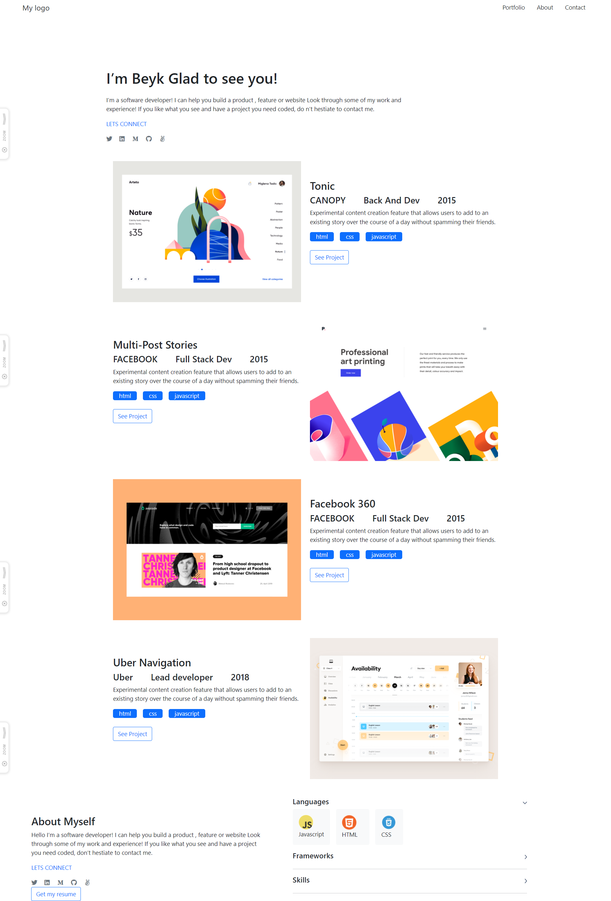

# Portfolio
>Portfolio: Desktop Version
We use bootstrap to do it without css

## Built With
- Html
- Bootstrap
## Authors
## Author1
**Beyk**
- GitHub: [@Beyk](https://github.com/beyk)
- Twitter: [@beyk_a](https://twitter.com/beyk_a)
- LinkedIn: [Beyk](https://www.linkedin.com/in/asghar-beykmohammadi-1b16b291/)
## Author2
 **kanocode**
- GitHub: [@KanoCode](https://github.com/KanoCode)
- Twitter: [@kanombola_s](https://https://mobile.twitter.com/kanombola_s)
- LinkedIn: [LinkedIn](https://www.linkedin.com/mwlite/in/kanombola-kanombola-a38b061a4)
